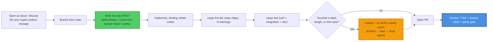

# Contributing to sk_pqc

Thanks for helping with `sk_pqc` (crate [`sk-pqc`](https://crates.io/crates/sk-pqc)) —
the sovereign shared Rust **post-quantum confidentiality toolkit** for the SK ecosystem:
a hybrid X25519 + ML-KEM-768 KEM (suite `x25519-mlkem768`, FIPS 203), DM + group epoch
ratchets, hybrid message sealing, the `pqroute1` routing envelope, anonymous-queue
addressing, the crypto-suite registry, and the honest self-report. This is cryptographic
infrastructure, so the bar is higher than a typical crate: changes are gated on
**cross-implementation parity**, and the project's honest-claim rules are
**non-negotiable**.

By participating you agree to the [Code of Conduct](CODE_OF_CONDUCT.md). All
contributions are licensed under **[Apache-2.0](LICENSE)**.

---

## Ground rules (read before you write code)

These come straight from the SKStacks
[CRYPTOGRAPHY_STANDARD](https://github.com/smilinTux/sk-standards) and the project
[SOP.md](SOP.md) §9 honesty gate — they are enforced in review:

1. **We bind vetted crypto; we never hand-roll primitives.** The lattice math is
   RustCrypto [`ml-kem`](https://crates.io/crates/ml-kem) (FIPS 203), the curve is
   [`x25519-dalek`](https://crates.io/crates/x25519-dalek), AEAD is
   [`aes-gcm`](https://crates.io/crates/aes-gcm), MACs are
   [`hmac`](https://crates.io/crates/hmac), hashing/KDF are `sha2` + `hkdf`, and
   constant-time compares are `subtle`. The **only** original cryptographic code is the
   combiner/label *wiring*. Do not add a hand-written primitive.
2. **The wire format is frozen.** The HKDF combiner
   `HKDF-SHA256(X25519_ss ‖ MLKEM768_ss)` (X25519 first, concat-then-KDF — **never XOR,
   never pure-PQ**), every HKDF/AAD `info` label, the canonical-JSON rules, and the
   fixed lengths (1216-B public key, 2432-B secret key, 1120-B ciphertext, 32-B shared
   secret) are a cross-language interop contract. Changing any of them breaks every peer
   and requires a **suite-id / major version bump with all three implementations updated
   in lockstep**, not a silent edit.
3. **Honest claims only.** In code, comments, docs, tests, commit messages, and any
   emitted string: say **"quantum-resistant"** / **"post-quantum,"** never
   "quantum-proof," "quantum-safe," or "unbreakable" (these are in
   `report::FORBIDDEN_WORDS` and are mechanically rejected). Every hybrid claim states
   it holds as long as **either** the X25519 leg **or** the ML-KEM-768 leg is unbroken;
   ML-KEM is cited as **FIPS 203**; no classical suite is ever marked
   quantum-resistant. This crate is **KEM + sealing + addressing**, not signatures —
   never imply it authenticates identity.
4. **No claim without a test.** Every cryptographic behaviour is backed by a unit test,
   doctest, or parity vector. If you can't test it, it doesn't ship.

---

## Development workflow



### Setup

```bash
git clone https://github.com/smilinTux/sk-pqc-rs
cd sk-pqc-rs
cargo build
```

> **Concurrency note:** sibling agents may share this checkout. Don't race another
> agent's `cargo` against the same `target/` — coordinate or set an isolated
> `CARGO_TARGET_DIR` (see [SOP.md](SOP.md) §3).

### Run the checks

```bash
cargo fmt --check                          # formatting
cargo clippy --all-targets -- -D warnings  # lints (no warnings allowed)
cargo test                                 # unit + integration tests
cargo test --doc                           # doctests (usage sketches)
cargo doc --no-deps                        # rustdoc must build; every public item documented
```

---

## What a good PR looks like

- **Scoped.** One logical change. Crypto-surface changes are discussed in an issue
  first.
- **Tested.** New behaviour has a unit/doc test or parity vector. Bug fixes add a
  regression test that fails before and passes after.
- **Green parity.** Any deterministic construction still derives identically across the
  Rust, Python (`skcomms`/`skchat`/`sksecurity`), and Dart (`sk_pqc`) implementations.
- **Honest.** No new claim exceeds the evidence; no forbidden words; KEM/sealing scope
  respected (no implied authentication).
- **Documented.** README / SOP / CHANGELOG updated when behaviour or interop changes.

### Change-risk tiers (T-tier)

Match your PR to a tier from [SOP.md](SOP.md) §9 so reviewers know the bar:

| Tier | Meaning | Review |
| --- | --- | --- |
| **T1** | Docs / comments only | 1 reviewer |
| **T2** | Additive, non-wire (helper, test, refactor) | 1 reviewer + tests |
| **T3** | Public API addition, no wire break | 2 reviewers + parity sanity |
| **T4** | Wire / label / length change (cross-impl break) | 2 reviewers + Python + Dart parity re-verify + **major** version bump |
| **T5** | Crypto-construction / primitive change | crypto review + all of T4 + SECURITY.md update |

### Especially welcome

- **PyO3 / FFI bindings** so mobile/desktop clients reuse this core (the documented
  follow-up).
- More **cross-impl parity vectors** (additional ACVP-anchored cases; more verifier
  languages).
- Pinning / hardening of the bound RustCrypto versions and clearer `report` hooks so
  consumers can prove `hybrid x25519-mlkem768 / FIPS 203` per surface.

### Out of scope (by design)

- **Signatures** (ML-DSA / SLH-DSA) — future work, not this crate.
- A hand-written primitive, or replacing a bound crate with home-grown math.
- **ML-KEM-1024 / CNSA-2.0** as the default — reserved for a sovereign root, not the
  internet-default -768 tier.

---

## Release (maintainers)

Gated on the §9 honesty + parity gate — see [SOP.md](SOP.md) §7:

1. Bump `version` in `Cargo.toml` per SemVer + add a `CHANGELOG.md` entry (a wire change
   is **never** a patch).
2. `cargo fmt --check && cargo clippy --all-targets -- -D warnings && cargo test && cargo doc --no-deps`.
3. `cargo publish --dry-run` (confirm wire-format lengths unchanged).
4. `cargo publish` → crates.io.
5. `git tag v<version> && git push --tags`, recording which Python / Dart commit the
   parity vectors were verified against in the release notes.

---

## Reporting security issues

**Do not** open a public issue for a vulnerability. Follow [SECURITY.md](SECURITY.md)
(private GitHub Security Advisory or maintainer contact, coordinated disclosure).

---

## Commits

Conventional, imperative subject lines (`fix:`, `feat:`, `test:`, `docs:`). Reference the
issue. Keep crypto-surface changes isolated from refactors so review can focus.

Thanks for keeping the crypto honest. 🐧 **SK = staycuriousANDkeepsmilin**
