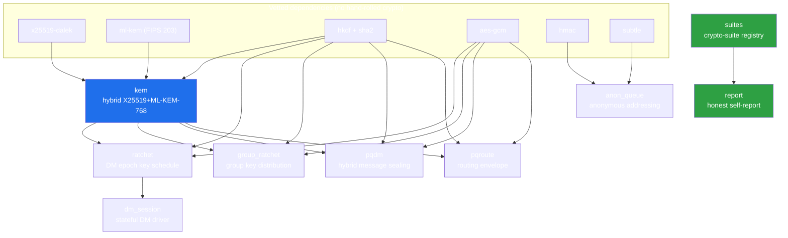

# SOP — sk_core

Standard Operating Procedure for the `sk_pqc` crate, per the **sk-standards** DOC_SOP
9-section template. This is the operational reference for building, testing, releasing,
and changing the sovereign shared Rust PQC core.

---

## 1. Purpose & scope

`sk_pqc` is a Rust library crate providing the SK ecosystem's post-quantum
confidentiality primitives: a hybrid X25519 + ML-KEM-768 KEM, DM and group epoch
ratchets, hybrid message sealing, a metadata-routing envelope, anonymous-queue
addressing, a crypto-suite registry, and an honest PQC self-report.

**In scope:** the cryptographic *constructions*, their byte-for-byte wire formats, and
their interoperability with the Python (`skcomms`/`skchat`/`sksecurity`) and Dart
(`sk_pqc`) implementations.

**Out of scope (by design, here):** networking/transport, persistence, FFI/PyO3 bindings,
key management/rotation policy, and identity/PKI. Those live in the consuming daemons.
This crate is pure computation — no I/O.

---

## 2. Architecture

The module dependency graph. `kem` is the root primitive; the sealing/ratchet layers
build on it; `suites` feeds `report`. No cycles.



See [docs/ARCHITECTURE.md](docs/ARCHITECTURE.md) for the per-hop data-flow of a DM sealing
path and the crypto posture at each step.

---

## 3. Prerequisites

- **Rust** ≥ 1.85 (Cargo `edition = "2021"`, `rust-version = "1.85"`).
- A working C/CSPRNG-backed `OsRng` (standard on Linux/macOS/Windows).
- No network, no system services, no secrets at build/test time.
- Dependencies are pinned in `Cargo.toml` / `Cargo.lock`: `x25519-dalek` 2,
  `ml-kem` 0.2.1, `hkdf` 0.12, `sha2` 0.10, `hmac` 0.12, `aes-gcm` 0.10, `rand` 0.8,
  `base64` 0.22, `hex` 0.4, `serde` 1 + `serde_json` 1, `subtle` 2.

> **Concurrency note:** sibling agents may share this checkout. Do **not** run a build/test
> that races another agent's `cargo` invocation against the same `target/`. Coordinate, or
> use an isolated `CARGO_TARGET_DIR`.

---

## 4. Build

```bash
cargo build                  # debug
cargo build --release        # optimized
cargo doc --no-deps --open   # render the full rustdoc (every public item is documented)
```

The crate is `no-network` and reproducible from `Cargo.lock`. There is no build script and
no `unsafe` in the crate's own code.

---

## 5. Test

Tests are inline `#[cfg(test)] mod tests` per module, plus `tests/integration.rs`.

```bash
cargo test                   # all unit + integration tests
cargo test --doc             # doctests (usage sketches)
cargo test -p sk_core kem    # a single module's tests
```

Each module covers four test classes:

1. **Determinism** — fixed inputs derive fixed outputs (KDF/label stability).
2. **Round-trip** — `seal`/`open`, `wrap`/`unwrap`, `encode`/`decode` invert.
3. **Tamper-reject** — flipped ciphertext / AAD / suite id / route header fails to open
   (never an oracle that distinguishes the cause).
4. **Python parity** — deterministic constructions pinned against a hardcoded value
   computed from the Python reference (e.g. `report::parity_dm_l3_hybrid_note_vector`,
   `report::parity_dm_classical_note_vector`).

A change that alters any wire byte MUST add or update a parity vector and be verified
against the Python and Dart implementations before release (see §9 gate).

---

## 6. API surface

Public entry points by module (full signatures in rustdoc):

| Module | Key public API |
| --- | --- |
| `kem` | `hybrid_keypair() -> HybridKeyPair`; `hybrid_encap(pub) -> (ct, ss)`; `hybrid_decap(ct, priv) -> ss`; length consts (`PUBLIC_KEY_LEN`=1216, `CIPHERTEXT_LEN`=1120, …); `KemError`. |
| `ratchet` | `derive_dm_message_key(secret, epoch, index)`; `new_epoch_secret()`; `wrap_dm_epoch_secret` / `unwrap_dm_epoch_secret`; `should_rekey`; `DmRatchet`; `RatchetError`. |
| `dm_session` | `DmSession::{new, with_bounds, seal, open, snapshot, restore}`; `SealedDmFrame::{to_token, from_token}`; `PQDR_SCHEME` (`"pqdr1:"`); `KAM_REPEAT`. |
| `group_ratchet` | `new_epoch_secret`; `wrap_epoch_secret` / `unwrap_epoch_secret`; `derive_message_key`; `EpochRatchet::{new, message_key, next_outbound_key, should_rekey}`; `GroupRatchetError`. |
| `pqdm` | `negotiate_suite`; `downgrade_lock_aad`; `seal` / `open_sealed`; `HYBRID_SUITE` / `CLASSICAL_SUITE`; `PqDmError`. |
| `pqroute` | `seal_routed` / `open_routed`; `read_route_header` / `replace_route_header`; `canonical`; `ROUTE_SUITE` (`"pqroute1"`); `PqRouteError`. |
| `anon_queue` | `new_queue_pair`; `encode_aqid` / `decode_aqid`; `auth_tag` / `verify_tag`; `AQID_SCHEME` (`"aqid:"`); `AnonQueueError`. |
| `suites` | `get_suite` / `all_suites` / `active_suites` / `suite_status` / `is_quantum_resistant`; `Registry`; `CryptoSuite`; `SuiteKind` / `SuiteStatus`. |
| `report` | `dm_ratchet_surface_for`; `conversation_surface_for`; `honest_claim`; `is_honest_note`; `SurfaceReport` / `Report`; `RatchetLevel`; `FORBIDDEN_WORDS`. |

**Stability:** the public API and the wire constants are an interop contract. Length
constants and HKDF/AAD labels MUST NOT change without a coordinated, parity-verified,
versioned wire bump across all three implementations.

---

## 7. Release (crates.io)

This crate follows the sk-standards VERSION_STANDARD (SemVer). Because the wire format is
a cross-language contract, **any wire-affecting change is a breaking change**.

```bash
# 0. Pre-flight: §9 gate must pass (tests green, honesty gate, parity verified).
cargo fmt --check
cargo clippy --all-targets -- -D warnings
cargo test
cargo doc --no-deps

# 1. Bump version in Cargo.toml per SemVer:
#    - patch: docs/internal only, no wire/API change
#    - minor: additive API, no wire break
#    - major: any wire/label/length change (cross-impl break)

# 2. Dry-run the package, then publish.
cargo publish --dry-run
cargo publish            # requires a crates.io token; repo = github.com/smilinTux/sk-core
```

Tag the release `v<version>` and record the parity-verification evidence (which Python /
Dart commit the vectors were checked against) in the release notes.

---

## 8. Operations & monitoring

`sk_pqc` is a library — it has no runtime, daemon, port, or log of its own. Operational
posture is observed through its **consumers**:

- The `report` module is the runtime honesty surface: consumers call
  `report::Report::from_surfaces(...)` / `.to_json()` to emit a per-surface PQC posture.
  A surface that reads `classical` / `quantum_resistant: false` is the signal that a
  conversation is HNDL-exposed (classical-only peer or a downgrade).
- The `suites` registry is the single source of truth for "what does this suite id mean";
  audit posture by inspecting `suites::active_suites()`.
- There is no telemetry, no callout, no I/O. Failures surface as typed `*Error` values to
  the caller, never as panics on malformed input.

---

## 9. Change control & honesty gate

Before any merge or release:

- [ ] **T-tier** assigned (see below) and reviewer matched to tier.
- [ ] `cargo test` green (unit + integration + doc), `cargo clippy -D warnings` clean.
- [ ] **No wire drift** unintended: if any length const or HKDF/AAD/JSON-canonical byte
      changed, it is intentional, versioned (major bump), and a parity vector was updated
      and **re-verified against the Python and Dart implementations**.
- [ ] **Honest-claims gate (blocking):** no code, doc, comment, test, or emitted string
      contains `quantum-proof`, `quantum-safe`, or `unbreakable`
      (`report::FORBIDDEN_WORDS`); every hybrid claim states "secure if **either** leg
      holds"; ML-KEM is cited as **FIPS 203**; no classical suite is marked
      quantum-resistant. `report::SurfaceReport::assert_honest` is the runtime backstop.
- [ ] **No hand-rolled crypto:** new crypto must bind a vetted RustCrypto/dalek crate;
      only label/wire wiring may be original.
- [ ] Rustdoc complete: `//!` module docs and `///` on every public item.

### T-tier (sk-standards change-risk tiers)

| Tier | Meaning | Examples in this crate | Review |
| --- | --- | --- | --- |
| **T1** | Docs / comments only, no behavior change | README, SOP, rustdoc edits | 1 reviewer |
| **T2** | Additive, non-wire (new helper, new test) | new `#[cfg(test)]` vector, internal refactor | 1 reviewer + tests |
| **T3** | Public API addition, no wire break | new `pub fn` that doesn't alter bytes | 2 reviewers + parity sanity |
| **T4** | Wire / label / length change (cross-impl break) | edit an HKDF `info`, a field length, canonical-JSON rules | 2 reviewers + Python + Dart parity re-verify + major version bump |
| **T5** | Crypto-construction / primitive change | swap a KEM/AEAD/MAC, change the combiner order | crypto review + all of T4 + SECURITY.md update |

This SOP is itself a **T1** document.
