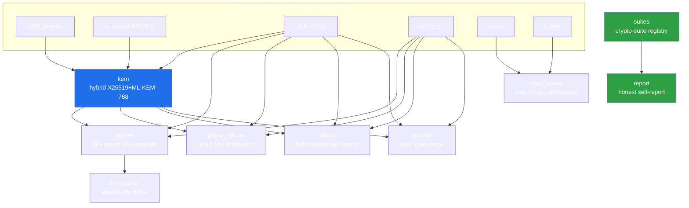

# SOP - sk_pqc

Standard Operating Procedure for the `sk_pqc` crate, per the **sk-standards**
SK_REPO_DOC_STANDARD 9-section template. This is the operational reference for
building, testing, releasing, and changing the sovereign shared Rust PQC core.

> **Two "T" scales, disambiguated.** `T0`-`T4` in this document always means the
> sk-standards **maturity** tier (section 9). This repo's **change-risk** classes, which
> were previously also written `T1`-`T5` and collided head-on with that scale, are now
> `R1`-`R5` (appendix A).

---

## 1. Overview

`sk_pqc` is a Rust library crate providing the SK ecosystem's post-quantum
confidentiality primitives: a hybrid X25519 + ML-KEM-768 KEM, DM and group epoch
ratchets, hybrid message sealing, a metadata-routing envelope, anonymous-queue
addressing, a crypto-suite registry, and an honest PQC self-report.

**In scope:** the cryptographic *constructions*, their byte-for-byte wire formats, and
their interoperability with the Python (`skcomms`/`skchat`/`sksecurity`) and Dart
(`sk_pqc`) implementations.

**Out of scope (by design, here):** networking/transport, persistence, FFI/PyO3 bindings,
key management/rotation policy, and identity/PKI. Those live in the consuming daemons.
This crate is pure computation — no I/O.

**Maturity tier: T2 (Hybrid KEM).** Per-axis evidence and the version reference are in
**section 9**. This crate is **KEM-only**: it authenticates nothing by itself, so an
unauthenticated peer key is trivially machine-in-the-middled. Pair it with a signature
layer and authenticate public keys out of band.

---

## 2. Architecture

The module dependency graph. `kem` is the root primitive; the sealing/ratchet layers
build on it; `suites` feeds `report`. No cycles.


```mermaid
graph TD
    subgraph deps["Vetted dependencies (no hand-rolled crypto)"]
        XK["x25519-dalek"]
        MK["ml-kem (FIPS 203)"]
        HK["hkdf + sha2"]
        AG["aes-gcm"]
        HM["hmac"]
        SB["subtle"]
    end

    KEM["kem<br/>hybrid X25519+ML-KEM-768"]
    RAT["ratchet<br/>DM epoch key schedule"]
    DMS["dm_session<br/>stateful DM driver"]
    GRP["group_ratchet<br/>group key distribution"]
    PQDM["pqdm<br/>hybrid message sealing"]
    PQR["pqroute<br/>routing envelope"]
    AQ["anon_queue<br/>anonymous addressing"]
    SUI["suites<br/>crypto-suite registry"]
    REP["report<br/>honest self-report"]

    XK --> KEM
    MK --> KEM
    HK --> KEM

    KEM --> RAT
    KEM --> GRP
    KEM --> PQDM
    KEM --> PQR

    HK --> RAT
    AG --> RAT
    RAT --> DMS

    HK --> GRP
    AG --> GRP

    HK --> PQDM
    AG --> PQDM

    HK --> PQR
    AG --> PQR

    HM --> AQ
    SB --> AQ

    SUI --> REP

    classDef root fill:#1f6feb,color:#fff
    classDef honesty fill:#2ea043,color:#fff
    class KEM root
    class REP,SUI honesty
```

See [docs/ARCHITECTURE.md](docs/ARCHITECTURE.md) for the per-hop data-flow of a DM sealing
path and the crypto posture at each step.

---

## 3. Build

```bash
cargo build                  # debug
cargo build --release        # optimized
cargo doc --no-deps --open   # render the full rustdoc (every public item is documented)
```

The crate is `no-network` and reproducible from `Cargo.lock`. There is no build script and
no `unsafe` in the crate's own code.

### 3.1 Prerequisites

- **Rust** ≥ 1.85 (Cargo `edition = "2021"`, `rust-version = "1.85"`).
- A working C/CSPRNG-backed `OsRng` (standard on Linux/macOS/Windows).
- No network, no system services, no secrets at build/test time.
- Dependencies are pinned in `Cargo.toml` / `Cargo.lock`: `x25519-dalek` 2,
  `ml-kem` 0.2.1, `hkdf` 0.12, `sha2` 0.10, `hmac` 0.12, `aes-gcm` 0.10, `rand` 0.8,
  `base64` 0.22, `hex` 0.4, `serde` 1 + `serde_json` 1, `subtle` 2.

> **Concurrency note:** sibling agents may share this checkout. Do **not** run a build/test
> that races another agent's `cargo` invocation against the same `target/`. Coordinate, or
> use an isolated `CARGO_TARGET_DIR`.

---

## 4. Test

Tests are inline `#[cfg(test)] mod tests` per module, plus `tests/integration.rs`.

```bash
cargo test                   # all unit + integration tests
cargo test --doc             # doctests (usage sketches)
cargo test -p sk_pqc kem    # a single module's tests
```

Each module covers four test classes:

1. **Determinism** — fixed inputs derive fixed outputs (KDF/label stability).
2. **Round-trip** — `seal`/`open`, `wrap`/`unwrap`, `encode`/`decode` invert.
3. **Tamper-reject** — flipped ciphertext / AAD / suite id / route header fails to open
   (never an oracle that distinguishes the cause).
4. **Python parity** — deterministic constructions pinned against a hardcoded value
   computed from the Python reference (e.g. `report::parity_dm_l3_hybrid_note_vector`,
   `report::parity_dm_classical_note_vector`).

A change that alters any wire byte MUST add or update a parity vector and be verified
against the Python and Dart implementations before release (see appendix A).

---

## 5. Release (crates.io)

This crate follows the sk-standards VERSION_STANDARD (SemVer). Because the wire format is
a cross-language contract, **any wire-affecting change is a breaking change**.

```bash
# 0. Pre-flight: appendix A gate must pass (tests green, honesty gate, parity verified).
cargo fmt --check
cargo clippy --all-targets -- -D warnings
cargo test
cargo doc --no-deps

# 1. Bump version in Cargo.toml per SemVer:
#    - patch: docs/internal only, no wire/API change
#    - minor: additive API, no wire break
#    - major: any wire/label/length change (cross-impl break)

# 2. Dry-run the package, then publish.
cargo publish --dry-run
cargo publish            # requires a crates.io token; repo = github.com/smilinTux/sk-pqc-rs
```

Tag the release `v<version>` and record the parity-verification evidence (which Python /
Dart commit the vectors were checked against) in the release notes.

### Front-end / Exposure

Per [sk-standards `UNIFIED_INGRESS_STANDARD.md`](https://github.com/smilinTux/sk-standards/blob/main/standards/UNIFIED_INGRESS_STANDARD.md):
**N/A — no network surface (library).** `sk_pqc` is a published crates.io library; it has
no runtime, daemon, port, or listener (see section 8.1) and answers no public `:443` route.

---

## 6. Configuration / Usage

`sk_pqc` is pure computation with **no runtime configuration**: no config file, no
environment variable, no network, and no I/O. Behavior is selected at **compile time**
through Cargo features, and per call through arguments.

### 6.1 Cargo features

Both optional features are **off by default**. The default build is pure Rust, and the
in-tree test suite never pulls in either binding.

| Feature | Pulls in | Builds | Use when |
|---|---|---|---|
| *(default)* | none | the pure-Rust library | you are a Rust consumer, or running the test suite |
| `python` | `pyo3` | the PyO3 `#[pymodule]` (`sk_pqc_rs`) into the cdylib (`src/python.rs`) | building the Python binding |
| `dart` | `flutter_rust_bridge` | the frb API and codegen glue (`src/frb_api.rs`, `src/frb_generated.rs`) | building the Dart / Flutter binding |

```bash
cargo build                     # pure Rust, no bindings
cargo build --features python   # + PyO3 module
cargo build --features dart     # + flutter_rust_bridge glue
```

> Keep both features off when running the honesty and parity gates. They add build
> surface that is irrelevant to the wire contract, and CI's default job is the one that
> must stay fast and reproducible.

### 6.2 Per-call knobs

The only "configuration" that changes bytes on the wire is the **domain-separation
label** and the **suite id**, and both are constants, not settings:

| Constant | Where | Value |
|---|---|---|
| `kem::SUITE_ID` | `src/kem.rs` | `"x25519-mlkem768"` |
| `kem::HKDF_INFO` | `src/kem.rs` | `b"sk_pqc/x25519-mlkem768/v1"` |
| `pqroute::ROUTE_SUITE` | `src/pqroute.rs` | `"pqroute1"` |
| `anon_queue::AQID_SCHEME` | `src/anon_queue.rs` | `"aqid:"` |
| `dm_session::PQDR_SCHEME` | `src/dm_session.rs` | `"pqdr1:"` |

**Changing any of these is a wire break** (change-risk class **R4** or **R5**, see the
appendix), not a configuration change. They are pinned by the docs-evidence block at
the end of this file.

---

## 7. API / Reference

Public entry points by module (full signatures in rustdoc):

| Module | Key public API |
| --- | --- |
| `kem` | `hybrid_keypair() -> HybridKeyPair`; `hybrid_encap(pub) -> (ct, ss)`; `hybrid_decap(ct, priv) -> ss`; length consts (`PUBLIC_KEY_LEN`=1216, `CIPHERTEXT_LEN`=1120, …); `KemError`. |
| `ratchet` | `derive_dm_message_key(secret, epoch, index)`; `new_epoch_secret()`; `wrap_dm_epoch_secret` / `unwrap_dm_epoch_secret`; `should_rekey`; `DmRatchet`; `RatchetError`. |
| `dm_session` | `DmSession::{new, with_bounds, seal, open, snapshot, restore}`; `SealedDmFrame::{to_token, from_token}`; `PQDR_SCHEME` (`"pqdr1:"`); `KAM_REPEAT`. |
| `group_ratchet` | `new_epoch_secret`; `wrap_epoch_secret` / `unwrap_epoch_secret`; `derive_message_key`; `EpochRatchet::{new, message_key, next_outbound_key, should_rekey}`; `GroupRatchetError`. |
| `pqdm` | `negotiate_suite`; `downgrade_lock_aad`; `seal` / `open_sealed`; `HYBRID_SUITE` / `CLASSICAL_SUITE`; `PqDmError`. |
| `pqroute` | `seal_routed` / `open_routed`; `read_route_header` / `replace_route_header`; `canonical`; `ROUTE_SUITE` (`"pqroute1"`); `PqRouteError`. |
| `anon_queue` | `new_queue_pair`; `encode_aqid` / `decode_aqid`; `auth_tag` / `verify_tag`; `AQID_SCHEME` (`"aqid:"`); `AnonQueueError`. |
| `suites` | `get_suite` / `all_suites` / `active_suites` / `suite_status` / `is_quantum_resistant`; `Registry`; `CryptoSuite`; `SuiteKind` / `SuiteStatus`. |
| `report` | `dm_ratchet_surface_for`; `conversation_surface_for`; `honest_claim`; `is_honest_note`; `SurfaceReport` / `Report`; `RatchetLevel`; `FORBIDDEN_WORDS`. |

**Stability:** the public API and the wire constants are an interop contract. Length
constants and HKDF/AAD labels MUST NOT change without a coordinated, parity-verified,
versioned wire bump across all three implementations.

---

## 8. Troubleshooting

| Symptom | Likely cause | Check / fix |
|---|---|---|
| `KemError::BadLength(what, expected, got)` | a key or ciphertext of the wrong size reached the wire | verify the composite lengths: public **1216**, private **2432**, ciphertext **1120**, shared secret **32**. These are fixed and pinned by `src/kem.rs` |
| `hybrid_decap` returns a secret that never matches | tampered or truncated ciphertext, or the peer used a different HKDF `info` | ML-KEM uses **implicit rejection**: a bad ciphertext does not error, it yields a pseudo-random secret. Confirm both sides use `HKDF_INFO = b"sk_pqc/x25519-mlkem768/v1"` and identical lengths |
| a parity vector fails after a refactor | a byte in a deterministic construction moved | this is the gate working. Do **not** update the vector to match the new output until you have confirmed the change was intended and re-verified against the Python and Dart implementations |
| `cargo test` passes locally but the Python or Dart sibling cannot open a blob | wire drift that no in-tree test covers | in-tree parity vectors pin *deterministic* constructions only. Cross-decapsulation must be re-checked against the sibling implementations, per section 5 |
| `open_sealed` fails on a message you believe is yours | negotiated-suite mismatch, or transcript tamper caught by the downgrade-lock AAD | this is `pqdm`'s downgrade lock **working**. Confirm both sides negotiated the same suite id |
| a build that worked now fails after another agent ran `cargo` | two agents sharing one `target/` directory | sibling agents may share this checkout. Use an isolated `CARGO_TARGET_DIR`, or coordinate |
| `cargo clippy` fails only with `--features python` or `--features dart` | binding-only code path | both features are off by default; the pure-Rust job is the reproducible one. Fix the binding, do not disable the lint |
| a self-report line reads `classical` / `quantum_resistant: false` | the conversation really is classical (classical-only peer, or a downgrade) | **not a bug.** That surface is HNDL-exposed and the report is telling the truth. See 8.1 |

### 8.1 Operations and monitoring

`sk_pqc` is a library. It has no runtime, daemon, port, or log of its own, so there is
nothing to monitor here directly. Operational posture is observed through its
**consumers**:

- The `report` module is the runtime honesty surface. Consumers call
  `report::Report::from_surfaces(...)` / `.to_json()` to emit a per-surface PQC posture.
  A surface reading `classical` / `quantum_resistant: false` is the signal that a
  conversation is HNDL-exposed (classical-only peer, or a downgrade).
- The `suites` registry is the single source of truth for what a suite id means. Audit
  posture by inspecting `suites::active_suites()`.
- There is **no telemetry, no callout, no I/O**. Failures surface as typed `*Error`
  values to the caller, **never as panics on malformed input**.

---

## 9. Maturity-tier + Version reference

> ⚠️ **Read this first: there are TWO "T" scales in the SK ecosystem, and they used to
> collide in this repo.** This section is the **maturity** scale (T0-T4) from the
> sk-standards CRYPTOGRAPHY_STANDARD, shared with the `sk-pqc-py` and `sk-pqc-dart`
> siblings. The **change-risk** scale used by this repo's merge gate was also labelled
> T1-T5, so "T2" meant *Hybrid KEM* in the siblings and *additive, non-wire change*
> here. **The change-risk scale has been renamed to R1-R5** (appendix A). Where you see
> a bare `T<n>` in this repo, it now always means maturity.

### Maturity tier: **T2**

Scale: [sk-standards `standards/CRYPTOGRAPHY_STANDARD.md`](https://github.com/smilinTux/sk-standards/blob/main/standards/CRYPTOGRAPHY_STANDARD.md).

| Tier | Meaning | `sk-pqc` (Rust) status | Evidence |
|---|---|---|---|
| **T0, Classical** | asymmetric crypto is classical | superseded for the hybrid KEM path. Classical suites remain **registered and labelled as classical**, which is what lets the self-report tell the truth about a classical peer. | `suites` registry; `DEFAULT_CONVERSATION_SUITE` |
| **T1, Agile** | suite ids + registry + backend abstraction + **self-report** | **met.** A real `suites` registry, and a `report` module that emits a per-surface posture with status, primitives and FIPS refs. | `suites::active_suites()`; `report::Report::to_json()` |
| **T2, Hybrid KEM** | key exchange uses `HKDF(X25519 \|\| MLKEM768)`; HNDL neutralised | **met. This is this crate's tier.** X25519 secret first, then ML-KEM-768, through HKDF-SHA256 to 32 bytes. | `kem::SUITE_ID`, `kem::HKDF_INFO`, the IKM ordering in `kem::combine`, all pinned below |
| **T3, Hybrid sig** | signatures use ML-DSA-65 + Ed25519 (additive) | **not met, out of scope.** This crate signs nothing. FIPS 204 is referenced only to scope it out. | (nothing to measure) |
| **T4, Transport closed** | edge-to-origin TLS hybrid | **N/A**, a library with no transport leg. | (nothing to measure) |

**Scope the T2 claim honestly.** It covers key distribution: a conversation whose key
was wrapped through this hybrid KEM is not HNDL-exposed. It does **not** cover a
conversation that negotiated a classical suite, and a ratchet over a *classical* KEM is
**still** HNDL-exposed no matter how many epochs it has. The `report` module says so
regardless of ratchet level, which is exactly the behavior to preserve.

### The honesty gate is enforced in CODE, not just in review

This crate is the only one of the three siblings that enforces the forbidden-word ban
**mechanically**, and that is worth copying rather than reimplementing:

| Symbol | File | Role |
|---|---|---|
| `report::FORBIDDEN_WORDS` | `src/report.rs` | `["quantum-proof", "quantum-safe", "unbreakable"]` |
| `report::is_honest_note` | `src/report.rs` | case-insensitive substring screen; **rejects** any note containing one |
| `report::SurfaceReport::assert_honest` | `src/report.rs` | debug-time backstop; also panics if a **classical** suite is marked quantum-resistant |

Two honest limits on that mechanism, so nobody over-reads it:

1. **It screens three words, not the standard's whole list.** The CRYPTOGRAPHY_STANDARD
   also forbids "CNSA 2.0 compliant", "FIPS 206" and "Falcon" in claims. Those are **not**
   in `FORBIDDEN_WORDS` and are caught only by human review (appendix A).
2. **It screens emitted report notes, not documentation.** Prose in this repo may name a
   forbidden word in order to prohibit it, and must be able to. The mechanical gate
   applies to strings the library *emits*.

The docs-evidence block below pins the constant's exact contents and both function
signatures, so weakening the gate fails the docs-check.

### Version reference

- **Source of truth:** `[package] version` in `Cargo.toml`. Nothing else restates it.
- **Published:** on crates.io as [`sk-pqc`](https://crates.io/crates/sk-pqc). Read the
  registry for the current version rather than trusting a number in this document.
- **Note the two names:** the **package** is `sk-pqc` (hyphen, what you depend on); the
  **library target** is `sk_pqc` (underscore, what you `use`). Both are pinned below.
- **Rust floor:** `rust-version = "1.85"`, `edition = "2021"`.
- **SemVer, with a wire caveat:** because the wire format is a cross-language contract,
  **any wire-affecting change is a breaking change** (major bump), regardless of how
  small the Rust-level diff looks. Additive API is minor; docs and internals are patch.
  Coordinate a wire break with `sk-pqc-py` and `sk-pqc-dart` in lockstep.

---

## Appendix A. Change control & honesty gate

Before any merge or release:

- [ ] **Change-risk class (R1-R5)** assigned (see below) and reviewer matched to it.
- [ ] `cargo test` green (unit + integration + doc), `cargo clippy -D warnings` clean.
- [ ] **No wire drift** unintended: if any length const or HKDF/AAD/JSON-canonical byte
      changed, it is intentional, versioned (major bump), and a parity vector was updated
      and **re-verified against the Python and Dart implementations**.
- [ ] **Honest-claims gate (blocking):** no code, doc, comment, test, or emitted string
      contains `quantum-proof`, `quantum-safe`, or `unbreakable`
      (`report::FORBIDDEN_WORDS`); every hybrid claim states "secure if **either** leg
      holds"; ML-KEM is cited as **FIPS 203**; no classical suite is marked
      quantum-resistant. `report::SurfaceReport::assert_honest` is the runtime backstop.
- [ ] **No hand-rolled crypto:** new crypto must bind a vetted RustCrypto/dalek crate;
      only label/wire wiring may be original.
- [ ] Rustdoc complete: `//!` module docs and `///` on every public item.

### Change-risk classes (R1-R5)

> **Renamed 2026-08-15.** These were previously labelled `T1`-`T5`, which collided
> with the sk-standards **maturity** tiers used by section 9 and by the `sk-pqc-py`
> and `sk-pqc-dart` siblings: `T2` meant *Hybrid KEM* there and *additive, non-wire
> change* here, for the same crate and the same suite. They are now `R1`-`R5`, and a
> bare `T<n>` in this repo always means maturity.

| Class | Meaning | Examples in this crate | Review |
| --- | --- | --- | --- |
| **R1** | Docs / comments only, no behavior change | README, SOP, rustdoc edits | 1 reviewer |
| **R2** | Additive, non-wire (new helper, new test) | new `#[cfg(test)]` vector, internal refactor | 1 reviewer + tests |
| **R3** | Public API addition, no wire break | new `pub fn` that doesn't alter bytes | 2 reviewers + parity sanity |
| **R4** | Wire / label / length change (cross-impl break) | edit an HKDF `info`, a field length, canonical-JSON rules | 2 reviewers + Python + Dart parity re-verify + major version bump |
| **R5** | Crypto-construction / primitive change | swap a KEM/AEAD/MAC, change the combiner order | crypto review + all of R4 + SECURITY.md update |

This SOP is itself an **R1** document.

---

## Unverified / needs an operator pass

Stated in this SOP but **not** re-executed while it was written:

- **The test suite was not run here.** Section 4's description and the parity-vector
  claims were read from `src/` and `tests/`, not executed. CI
  (`.github/workflows/ci.yml`) runs `cargo test --locked --all-targets`,
  `cargo fmt --all --check` and `cargo clippy --locked --all-targets -- -D warnings`,
  all as **hard** gates with no `continue-on-error` and no `|| true`.
- **Cross-language parity was not re-proven.** The claim that a blob sealed here opens
  in the Python and Dart siblings rests on in-tree parity vectors plus prior
  verification, not on a three-way run performed for this document. What *is* verified
  here is that this crate's suite id, HKDF label, IKM ordering and length constants
  still match what the docs and the siblings state.
- **The crates.io release flow** in section 5 was read from the SOP and
  `.github/workflows/publish.yml`, not exercised. `sk-pqc 0.1.0` is present on crates.io.
- **`wasm/pkg/` is committed build output**, including the binary
  `wasm/pkg/sk_pqc_wasm_bg.wasm` and its generated `.js` / `.d.ts` / `package.json`.
  Nothing regenerates or validates it on push, so it will drift from `wasm/src/lib.rs`
  silently, and a committed binary is not reviewable in a diff. Left in place by this
  docs-only change; removing it plus a `.gitignore` entry, or building it in CI, is a
  follow-up for a code PR.
- **The dependency versions** listed under Build were read from `Cargo.toml`; only the
  crate names and the Rust floor are pinned by the docs-evidence block.

---

<!-- docs-evidence
verified: 2026-08-15
checks:
  - name: the forbidden-word list is still exactly the documented three (SOP 9)
    run: grep -qF 'pub const FORBIDDEN_WORDS: &[&str] = &["quantum-proof", "quantum-safe", "unbreakable"];' src/report.rs
  - name: the code-enforced honesty screen still exists (SOP 9, SECURITY)
    run: grep -qE '^pub fn is_honest_note\(note: &str\) -> bool \{' src/report.rs && grep -qE '^    pub fn assert_honest\(&self\) \{' src/report.rs
  - name: suite id and HKDF label unchanged (SOP 6.2, 7)
    run: grep -qE '^pub const SUITE_ID: &str = "x25519-mlkem768";$' src/kem.rs && grep -qE '^pub const HKDF_INFO: &\[u8\] = b"sk_pqc/x25519-mlkem768/v1";$' src/kem.rs
  - name: combiner IKM is X25519 FIRST then ML-KEM (SOP 9, the interop invariant)
    run: grep -A1 'ikm.extend_from_slice(x25519_ss);' src/kem.rs | grep -q 'ikm.extend_from_slice(mlkem_ss);'
  - name: wire-format leg sizes unchanged (SOP 7, 8)
    run: grep -qE '^pub const X25519_PUB_LEN: usize = 32;$' src/kem.rs && grep -qE '^pub const MLKEM_PUB_LEN: usize = 1184;$' src/kem.rs && grep -qE '^pub const MLKEM_SECRET_LEN: usize = 2400;$' src/kem.rs && grep -qE '^pub const MLKEM_CT_LEN: usize = 1088;$' src/kem.rs && grep -qE '^pub const SHARED_SECRET_LEN: usize = 32;$' src/kem.rs
  - name: documented wire scheme prefixes unchanged (SOP 6.2)
    run: grep -qE '^pub const ROUTE_SUITE: &str = "pqroute1";$' src/pqroute.rs && grep -qE '^pub const AQID_SCHEME: &str = "aqid:";$' src/anon_queue.rs && grep -qE '^pub const PQDR_SCHEME: &str = "pqdr1:";$' src/dm_session.rs
  - name: package name, lib name and Rust floor match the docs (SOP 9)
    run: grep -qE '^name = "sk-pqc"$' Cargo.toml && grep -qE '^name = "sk_pqc"$' Cargo.toml && grep -qE '^rust-version = "1\.85"$' Cargo.toml
  - name: both bindings stay OFF by default (SOP 6.1)
    run: grep -qE '^python = \["dep:pyo3"\]$' Cargo.toml && grep -qE '^dart = \["dep:flutter_rust_bridge"\]$' Cargo.toml
  - name: the change-risk scale is R1-R5, never T1-T5 (SOP appendix A, the tier collision)
    run: grep -qE '^\| \*\*R1\*\* \|' SOP.md && grep -qE '^\| \*\*R5\*\* \|' SOP.md && grep -qE '^\| \*\*R1\*\* \|' CONTRIBUTING.md
  - name: entry points named in SOP 2 exist
    run: test -f src/lib.rs && test -f src/kem.rs && test -f src/report.rs && test -f src/suites.rs
-->
