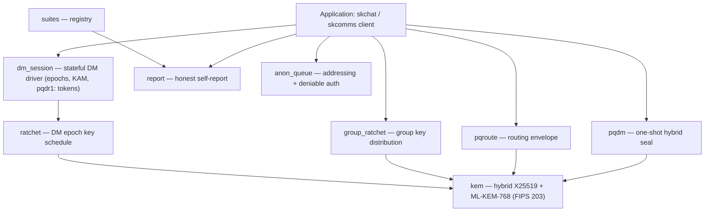
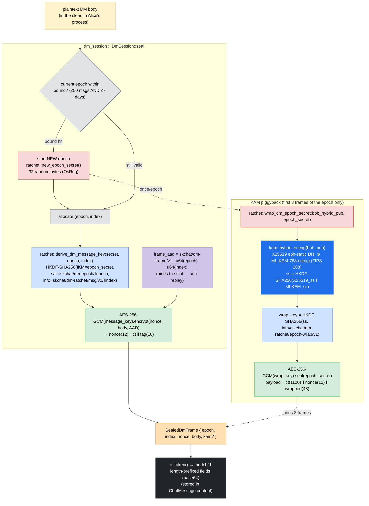
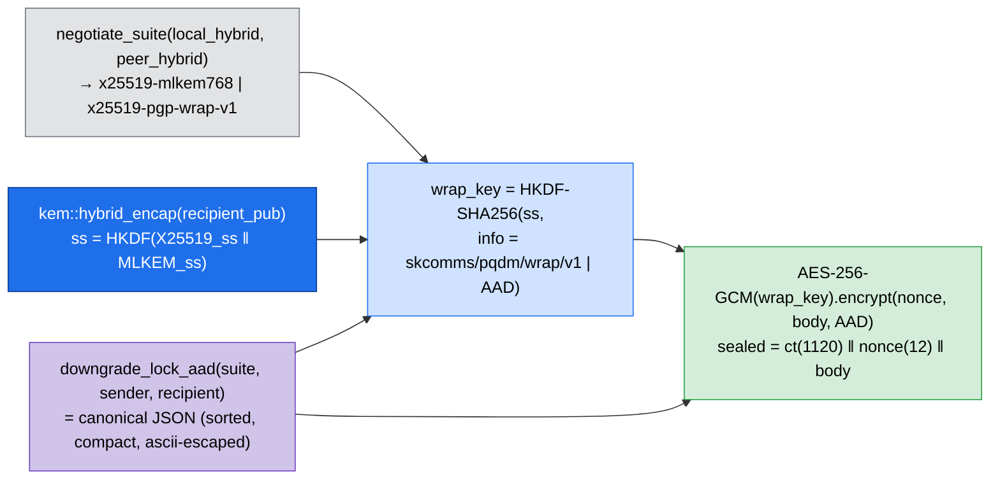

# Architecture — sk_core

This document gives the **data-flow** view of `sk_pqc`, per the sk-standards
DATA_FLOW_STANDARD: it traces a concrete DM-sealing path **hop by hop**, naming the module,
the operation, and the **crypto posture** (what protects the bytes) at each step. For the
static module dependency graph see [../SOP.md](../SOP.md) §2; for module summaries see
[../README.md](../README.md).

---

## Layering

---

## Data-flow: sealing a DM frame (the `dm_session` → `ratchet` → `kem` path)

The marquee path. Alice seals a 1:1 DM body to Bob. The diagram shows where the bytes
flow, which module owns each hop, and the **crypto posture** (the box style) at that hop.

### Crypto posture per hop

| Hop | Module | Operation | Posture / what protects it |
| --- | --- | --- | --- |
| plaintext | (app) | DM body in process memory | **none** — cleartext, endpoint-trusted only |
| epoch check | `dm_session` | bound = 50 msgs **OR** 7 days | control logic; drives FS/PCS by forcing rekey |
| new epoch secret | `ratchet` | `new_epoch_secret()` 32 B `OsRng` | **secret** — independent per epoch (PCS root) |
| message key | `ratchet` | HKDF-SHA256 keyed by epoch secret, domain-separated by `dm-epoch`/`dm-ratchet` labels + `(epoch,index)` | **KDF** — index-addressable, loss/reorder tolerant |
| frame AAD | `dm_session` | `skchat/dm-frame/v1 \| epoch index` | **AAD bind** — anti-replay, frame can't move slots |
| body seal | `dm_session` | AES-256-GCM(message_key) | **AEAD** — confidentiality + integrity (symmetric, quantum-acceptable) |
| KAM: hybrid encap | `kem` | X25519 ⊕ ML-KEM-768, `HKDF(X25519_ss ‖ MLKEM_ss)` | **hybrid PQ** — secure if **either** leg holds (FIPS 203 ML-KEM) |
| KAM: wrap key | `ratchet` | HKDF-SHA256 over KEM secret, `epoch-wrap` label | **KDF** — domain-separated from message keys |
| KAM: seal secret | `ratchet` | AES-256-GCM(wrap_key).seal(epoch_secret) | **AEAD** — the epoch secret is the only PQ-protected material; paid 3×/epoch, not per message |
| frame token | `dm_session` | `pqdr1:` length-prefixed base64 | **wire** — coexists with PGP `-----BEGIN` and one-shot `pqdm1:` in the same field |

**Posture summary.** The bulk body is sealed under a *symmetric* AES-256-GCM key (already
quantum-acceptable). The **only** asymmetric/PQ material on the wire is the per-epoch
secret, wrapped via the **hybrid** KEM and amortised across the epoch — so the recorded
transcript is HNDL-resistant (secure unless **both** X25519 and ML-KEM-768 break), while
the per-message cost stays symmetric.

---

## Data-flow: the one-shot seal (`pqdm`) and the downgrade-lock

The `pqdm::seal` path used for stateless DM/envelope bodies (`pqdm1:` token). Same hybrid
root, with the **negotiated suite bound into the AEAD AAD** as a downgrade-lock.

Because the suite id is folded into both the wrap-key `info` **and** the AEAD AAD, a MITM
that strips the hybrid prekey to force `x25519-pgp-wrap-v1` changes the bytes the sender
seals under — the recipient's open fails or the recorded suite no longer reads hybrid. The
downgrade cannot be *silent*, and `report::conversation_surface_for` surfaces a `classical`
line rather than an invented hybrid one.

---

## The honesty surface (`suites` → `report`)

```mermaid
flowchart LR
    SID["suite_id on the wire<br/>(e.g. x25519-mlkem768)"]:::wire
    REG["suites::get_suite(id)<br/>(unknown ⇒ classical ⇒ never QR)"]:::logic
    RES["status · primitives · fips_refs · quantum_resistant"]:::logic
    NOTE["report builds honest note<br/>(hybrid = secure if EITHER leg holds; cites FIPS 203)"]:::aad
    GATE["is_honest_note() screen<br/>+ assert_honest() backstop<br/>(rejects quantum-proof / -safe / unbreakable)"]:::gate
    OUT["SurfaceReport / Report → JSON"]:::wire
    SID --> REG --> RES --> NOTE --> GATE --> OUT

    classDef wire fill:#212529,stroke:#000,color:#fff
    classDef logic fill:#e2e3e5,stroke:#6c757d,color:#000
    classDef aad fill:#d1c4e9,stroke:#6f42c1,color:#000
    classDef gate fill:#2ea043,stroke:#15682b,color:#fff
```

Status is resolved **only** from the registry; the report only *narrates* what the registry
says, and the honesty gate is mechanical — a classical or unknown suite can never be marked
quantum-resistant, and the forbidden marketing words can never reach a caller.

---

## Cross-language note

Every label, length, AAD byte, and canonical-JSON rule shown above is shared verbatim with
the Python (`sk-pqc-py`) and Dart (`sk_pqc`) implementations. A blob sealed by any one of
the three opens in the other two; deterministic constructions are pinned by parity test
vectors (see [../SOP.md](../SOP.md) §5).
